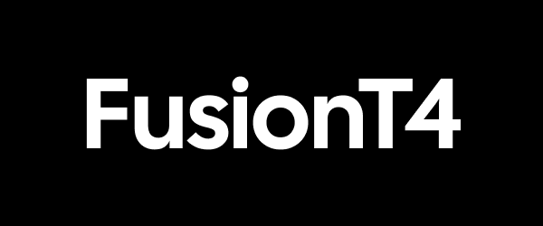

  

Fusion T4

Building the infrastructure that powers the next generation of intelligent business operations.

Fusion T4 is an engineering-focused organization dedicated to building intelligent systems, AI-powered workflows, business automation, and scalable software solutions.

Our mission is to help organizations move beyond isolated tools and create connected systems that automate operations, improve decision-making, and unlock new levels of efficiency.

What We Build

- AI Agents
- Workflow Automation
- System Integrations
- Internal Business Platforms
- Productivity Tools
- AI-Powered Applications
- Custom Software Solutions
- Developer Infrastructure

Our Approach

We believe the future of business lies in intelligent systems that can seamlessly connect data, processes, people, and software.

Rather than treating AI as a standalone tool, we focus on building reliable infrastructure that enables businesses to operate more efficiently, automate repetitive work, and scale with confidence.

Focus Areas

- Autonomous Workflows
- Business Process Automation
- AI Integration
- Enterprise Systems
- Operational Intelligence
- Developer Experience
- Scalable Architecture

Engineering Principles

- Simplicity over complexity
- Automation over repetition
- Reliability over hype
- Scalability by design
- Continuous improvement

---

Building systems that enable businesses to think smarter, move faster, and operate more intelligently.
